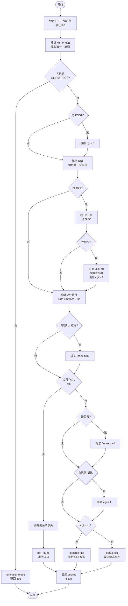
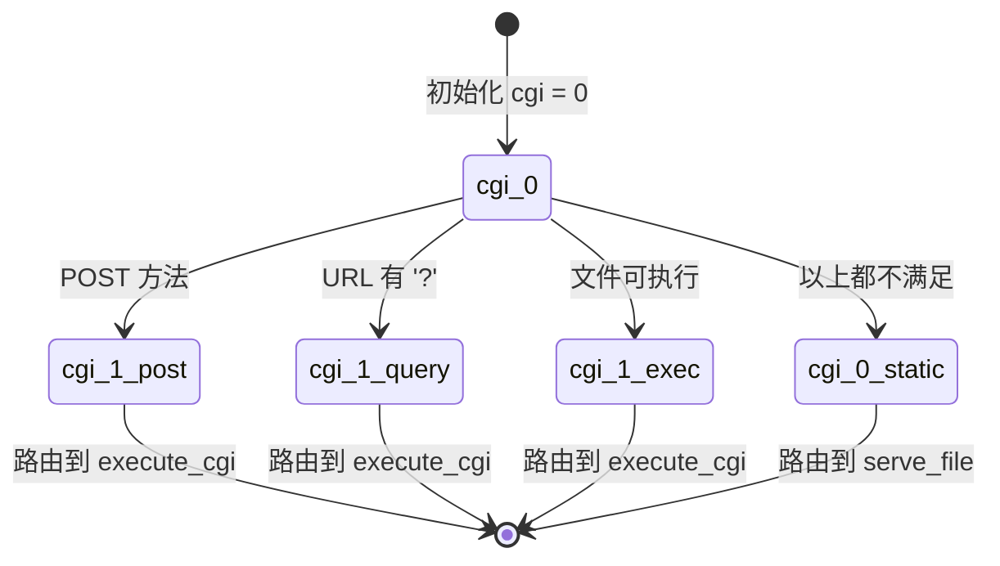
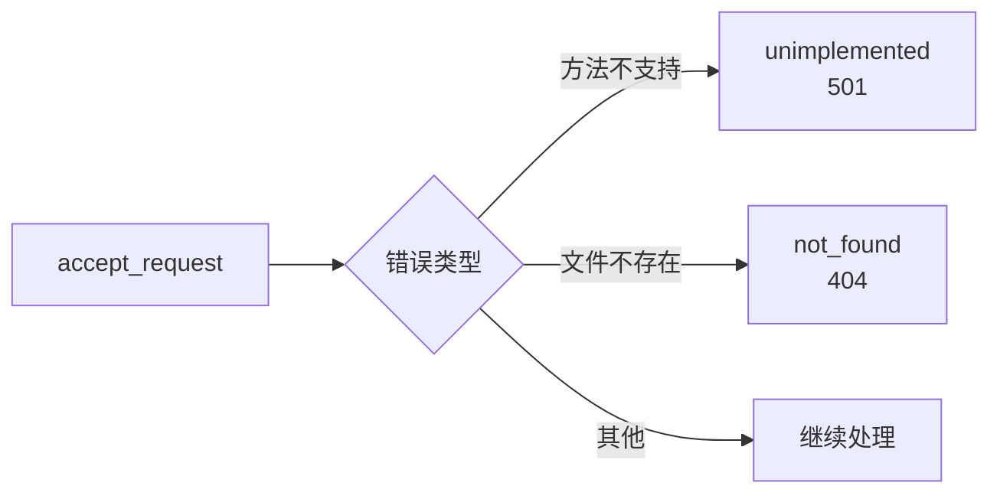

# accept_request() 详细流程图

## 主流程图



## cgi 标志设置追踪



## 数据流示例

### 示例 1：静态文件

```
输入：
  客户端请求："GET /index.html HTTP/1.1"

处理流程：
  ┌─────────────────────────────────┐
  │ 读取请求行                      │
  │ buf = "GET /index.html HTTP/1.1"│
  └──────────┬──────────────────────┘
             ↓
  ┌─────────────────────────────────┐
  │ 解析方法                        │
  │ method = "GET"                  │
  └──────────┬──────────────────────┘
             ↓
  ┌─────────────────────────────────┐
  │ 解析 URL                        │
  │ url = "/index.html"             │
  └──────────┬──────────────────────┘
             ↓
  ┌─────────────────────────────────┐
  │ GET 方法，查找 '?'              │
  │ 没有找到                        │
  │ cgi 保持为 0                    │
  └──────────┬──────────────────────┘
             ↓
  ┌─────────────────────────────────┐
  │ 构建路径                        │
  │ path = "htdocs/index.html"      │
  └──────────┬──────────────────────┘
             ↓
  ┌─────────────────────────────────┐
  │ stat() 检查文件                 │
  │ 文件存在，不是目录              │
  │ 没有执行权限                    │
  │ cgi 保持为 0                    │
  └──────────┬──────────────────────┘
             ↓
  ┌─────────────────────────────────┐
  │ 路由                            │
  │ cgi == 0                        │
  │ → serve_file(client, path)      │
  └─────────────────────────────────┘

输出：
  发送 htdocs/index.html 的内容
```

### 示例 2：CGI（带查询字符串）

```
输入：
  客户端请求："GET /color.cgi?color=red HTTP/1.1"

处理流程：
  ┌─────────────────────────────────────────┐
  │ 读取请求行                              │
  │ buf = "GET /color.cgi?color=red HTTP..." │
  └──────────┬──────────────────────────────┘
             ↓
  ┌─────────────────────────────────────────┐
  │ 解析方法                                │
  │ method = "GET"                          │
  └──────────┬──────────────────────────────┘
             ↓
  ┌─────────────────────────────────────────┐
  │ 解析 URL                                │
  │ url = "/color.cgi?color=red"            │
  └──────────┬──────────────────────────────┘
             ↓
  ┌─────────────────────────────────────────┐
  │ GET 方法，查找 '?'                      │
  │ 找到了！                                │
  │ 设置 cgi = 1                            │
  │ 分离：url = "/color.cgi"                │
  │      query_string = "color=red"         │
  └──────────┬──────────────────────────────┘
             ↓
  ┌─────────────────────────────────────────┐
  │ 构建路径                                │
  │ path = "htdocs/color.cgi"               │
  └──────────┬──────────────────────────────┘
             ↓
  ┌─────────────────────────────────────────┐
  │ stat() 检查文件                         │
  │ 文件存在，不是目录                      │
  │ 有执行权限（但 cgi 已经是 1 了）       │
  └──────────┬──────────────────────────────┘
             ↓
  ┌─────────────────────────────────────────┐
  │ 路由                                    │
  │ cgi == 1                                │
  │ → execute_cgi(client, path, method, qs) │
  └─────────────────────────────────────────┘

输出：
  执行 htdocs/color.cgi，传递查询字符串
  发送 CGI 的输出
```

### 示例 3：CGI（POST）

```
输入：
  客户端请求："POST /form.cgi HTTP/1.1"
  请求体："name=Alice&age=25"

处理流程：
  ┌─────────────────────────────────┐
  │ 读取请求行                      │
  │ buf = "POST /form.cgi HTTP/1.1" │
  └──────────┬──────────────────────┘
             ↓
  ┌─────────────────────────────────┐
  │ 解析方法                        │
  │ method = "POST"                 │
  └──────────┬──────────────────────┘
             ↓
  ┌─────────────────────────────────┐
  │ 检查方法                        │
  │ 是 POST → 设置 cgi = 1          │
  └──────────┬──────────────────────┘
             ↓
  ┌─────────────────────────────────┐
  │ 解析 URL                        │
  │ url = "/form.cgi"               │
  └──────────┬──────────────────────┘
             ↓
  ┌─────────────────────────────────┐
  │ 不是 GET，跳过查询字符串处理    │
  │ query_string = NULL             │
  └──────────┬──────────────────────┘
             ↓
  ┌─────────────────────────────────┐
  │ 构建路径                        │
  │ path = "htdocs/form.cgi"        │
  └──────────┬──────────────────────┘
             ↓
  ┌─────────────────────────────────┐
  │ stat() 检查文件                 │
  │ 文件存在，有执行权限            │
  │ （cgi 已经是 1）                │
  └──────────┬──────────────────────┘
             ↓
  ┌─────────────────────────────────┐
  │ 路由                            │
  │ cgi == 1                        │
  │ → execute_cgi(client, path, ...)│
  └─────────────────────────────────┘

输出：
  execute_cgi 会读取请求体
  传递给 CGI 脚本
  发送 CGI 的输出
```

## 错误处理流程



## 关键代码片段映射

| 流程步骤 | 代码位置 | 关键变量 |
|---------|---------|---------|
| 读取请求行 | Line 93 | `buf`, `numchars` |
| 解析方法 | Line 96-103 | `method`, `i`, `j` |
| 检查方法 | Line 105-109 | `method` |
| POST 处理 | Line 111-112 | `cgi` |
| 解析 URL | Line 114-123 | `url`, `i`, `j` |
| 查询字符串 | Line 125-137 | `query_string`, `cgi` |
| 构建路径 | Line 139-141 | `path` |
| 文件检查 | Line 143-155 | `st`, `cgi` |
